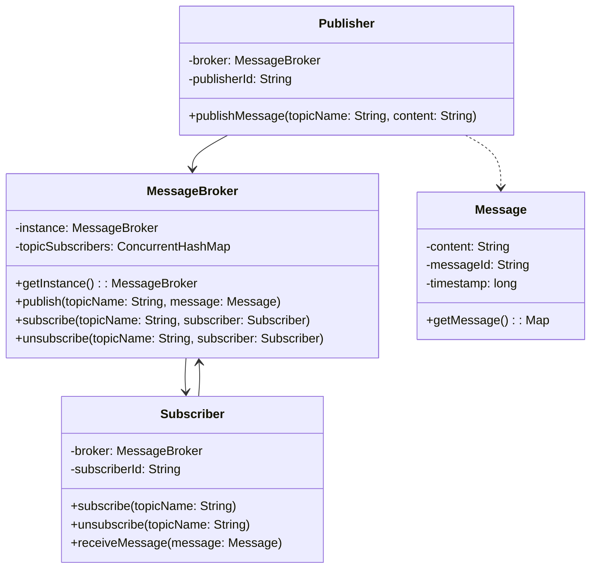
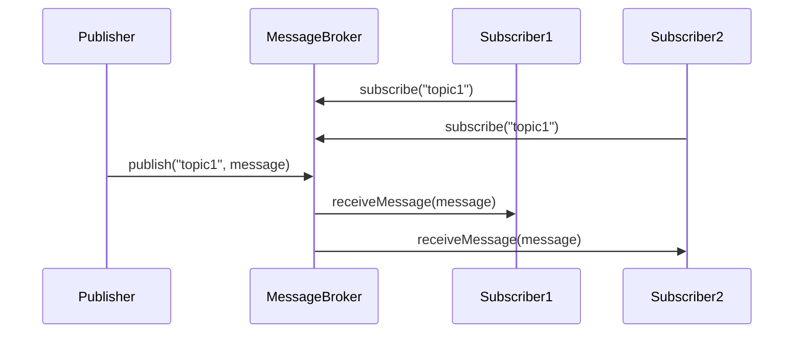
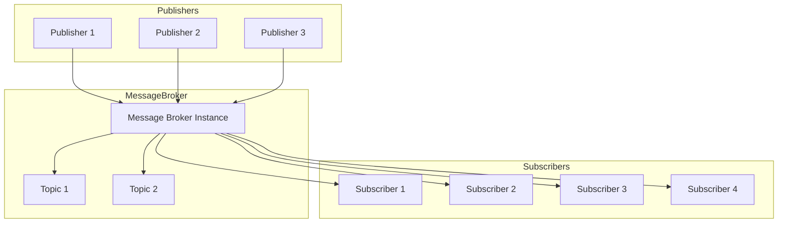

# Pub/Sub System Documentation

## Overview
This is a thread-safe publish/subscribe messaging system that implements the Observer pattern using a centralized message broker. The system allows multiple publishers and subscribers to communicate asynchronously through topics.

## Core Components

### 1. MessageBroker
- Singleton class that manages all pub/sub communications
- Maintains thread-safe topic-subscriber mappings
- Handles message distribution to subscribers

### 2. Publisher
- Creates and publishes messages to specific topics
- Communicates only with the MessageBroker
- Can be instantiated multiple times

### 3. Subscriber
- Subscribes to topics of interest
- Receives messages from the MessageBroker
- Can be instantiated multiple times

### 4. Message
- Contains the message content and metadata
- Immutable once created

## Architecture Diagrams

### Class Relationship Diagram


### Message Flow Diagram


### System Architecture


## Usage Example

```java
// Create publisher and subscribers
Publisher publisher = new Publisher("Publisher-1");
Subscriber subscriber1 = new Subscriber("Subscriber-1");
Subscriber subscriber2 = new Subscriber("Subscriber-2");

// Subscribe to topics
subscriber1.subscribe("topic1");
subscriber2.subscribe("topic1");

// Publish messages
publisher.publishMessage("topic1", "Hello World!");
```

## Thread Safety
- Uses `ConcurrentHashMap` for topic-subscriber mapping
- Uses `CopyOnWriteArraySet` for subscriber collections
- Thread-safe singleton implementation for MessageBroker
- Safe for multiple publisher and subscriber threads

## Key Features
1. Decoupled Publishers and Subscribers
2. Thread-safe message delivery
3. Multiple topics support
4. Dynamic subscription management
5. Asynchronous message processing

## Best Practices
1. Always maintain a single MessageBroker instance
2. Use unique IDs for publishers and subscribers
3. Handle InterruptedException in subscriber threads
4. Properly close/unsubscribe when done
5. Implement error handling in message processing

## Limitations
1. In-memory message broker (messages not persisted)
2. No message queuing (immediate delivery)
3. No message acknowledgment
4. No message retry mechanism